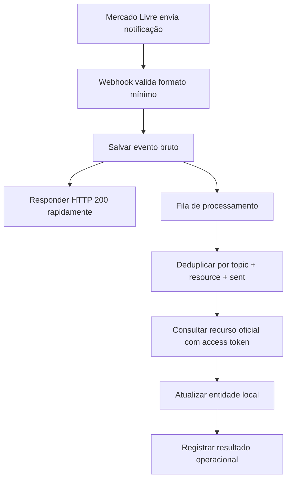

# Capítulo 09 · Notificações e webhooks

## Para quem é este capítulo

Para integradores que querem parar de depender apenas de polling e receber mudanças de pedidos, envios, pagamentos, mensagens e anúncios com menor atraso.

## Pré-requisitos

- Aplicação criada no painel de desenvolvedores.
- URL pública HTTPS para callback.
- Tópicos configurados na aplicação.
- Rotina de consulta autenticada para buscar o recurso indicado na notificação.

Notificações avisam que algo mudou; elas não devem ser tratadas como a fonte final de dados. A fonte final é o recurso da API apontado em `resource`.

## Configuração no painel

1. Acesse a área de aplicações do Mercado Livre.
2. Edite a aplicação usada na integração.
3. Informe a URL pública de callback.
4. Selecione os tópicos que sua aplicação realmente processa.
5. Salve e faça um teste controlado com uma conta de desenvolvimento ou conta autorizada.

Evite assinar tópicos que você ainda não trata. Volume sem processamento vira ruído operacional.

## Formato geral da notificação

Exemplo simplificado:

```json
{
  "resource": "/orders/1234567890",
  "user_id": 123456789,
  "topic": "orders_v2",
  "application_id": 987654321,
  "attempts": 1,
  "sent": "2026-04-24T13:00:00.000Z",
  "received": "2026-04-24T13:00:00.000Z"
}
```

Campos que devem ir para log:

- `resource`
- `topic`
- `user_id`
- `application_id`
- `attempts`
- `sent`
- payload bruto

## Fluxo recomendado de processamento



O ponto mais importante é responder rápido. Não faça consulta externa pesada antes de devolver `200`, porque timeout no webhook tende a gerar novas tentativas.

## Exemplo mínimo de handler

Este exemplo é propositalmente incompleto: ele mostra a arquitetura, não uma aplicação pronta.

```py
def receive_notification(payload: dict) -> tuple[dict, int]:
    required = {"resource", "topic", "user_id", "application_id"}
    missing = required - payload.keys()
    if missing:
        return {"ok": False, "missing": sorted(missing)}, 400

    save_raw_event(payload)
    enqueue_notification(
        topic=payload["topic"],
        resource=payload["resource"],
        user_id=payload["user_id"],
        sent=payload.get("sent"),
    )
    return {"ok": True}, 200
```

Na fila, a rotina consulta o recurso:

```py
def process_notification(event: dict, access_token: str) -> None:
    resource = event["resource"]
    url = f"https://api.mercadolibre.com{resource}"
    data = http_get_json(url, access_token=access_token)
    update_local_projection(event["topic"], data)
```

## Tópicos comuns

| Tópico | Uso típico |
| --- | --- |
| `items` | Mudanças em anúncios. |
| `orders_v2` ou orders | Criação e mudanças de pedidos, conforme disponibilidade da aplicação. |
| `shipments` | Criação e alterações de envios. |
| `payments` | Criação ou alteração de pagamentos. |
| `messages` | Mensagens e pós-venda. |
| `questions` | Perguntas em anúncios. |

Confirme os tópicos disponíveis no painel da sua aplicação, porque disponibilidade pode variar por produto, país e escopo.

## Idempotência

Notificações podem chegar repetidas, fora de ordem ou depois de você já ter atualizado o recurso por polling. Por isso:

- salve evento bruto antes de processar;
- deduplique eventos iguais;
- use `last_updated`, versão ou data do recurso para evitar voltar estado;
- mantenha uma rotina de reprocessamento manual;
- registre falhas com motivo técnico e contexto de negócio.

## Segurança operacional

- Aceite apenas `POST`.
- Use HTTPS.
- Limite tamanho do corpo da requisição.
- Não exponha tokens em URL.
- Valide JSON antes de enfileirar.
- Use logs sem dados sensíveis desnecessários.
- Monitore taxa de `4xx`, `5xx`, tempo de resposta e tamanho da fila.

## Quando ainda usar polling

Mesmo com notificações, mantenha rotinas de reconciliação:

- importação periódica de pedidos por data;
- rechecagem de envios em andamento;
- auditoria de pagamentos divergentes;
- recuperação de eventos se o webhook ficou fora do ar.

Webhook reduz atraso, mas não substitui uma rotina de conferência.

## Falhas comuns

- Webhook demora e o Mercado Livre tenta novamente.
- Sistema processa a notificação como verdade final e não consulta `resource`.
- Falta de deduplicação cria pedido, pagamento ou rastreio duplicado.
- Token do vendedor não é encontrado a partir de `user_id`.
- Tópico assinado não tem processador implementado.

## Referências oficiais

- [Receive notifications](https://developers.mercadolivre.com.br/en_us/products-receive-notifications)
- [Notificações pós-venda](https://developers.mercadolivre.com.br/pt_br/mensagens-post-venda/produto-receba-notificacoes)

